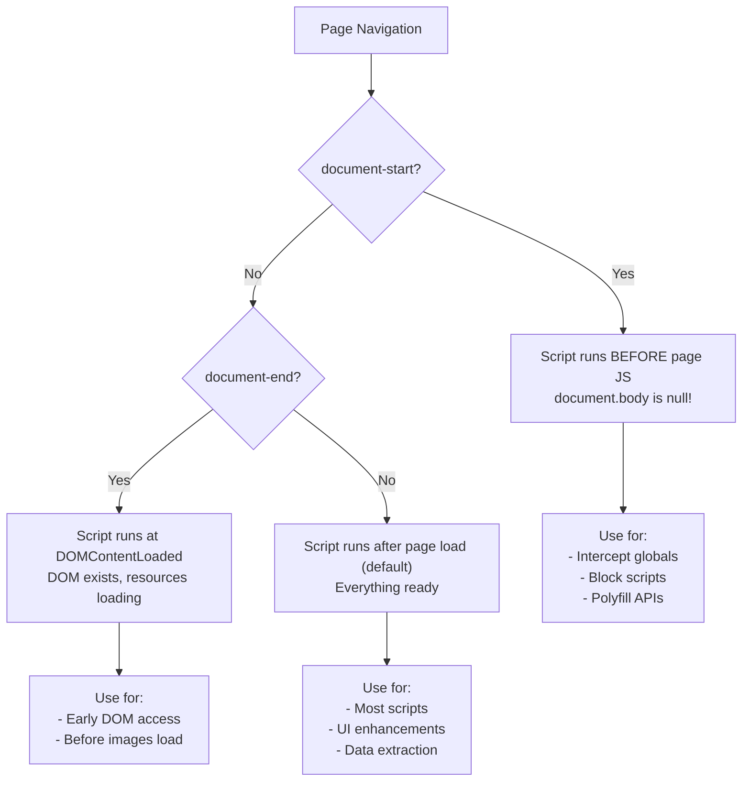

# Epupp User Guide

Epupp is a browser extension for tampering with web pages - live, or with userscripts.

## Three Contexts for Evaluation

Epupp provides three ways to script pages you visit:

### Userscripts

Customization of web pages you visit. (Similar to TamperMonkey)

- Saved in the browser
- Automatic execution on matching sites (by URL pattern, TamperMonkey compatible). Lets you autorun the script at different points in page loading:
  - Before the page loads (`document-start`) - intercept globals, no DOM access yet
  - At document idle (default) - everything loaded, DOM ready
  - At document end - DOM ready but resources still loading
- Manual execution from the script listing

### REPL

Hook the Epupp REPL into your editor and/or hand it to your AI agent. Epupp uses [ClojureScript](https://clojurescript.org) for tampering, supporting full interactive development.

- Use your favorite editor
- Easy to do quick experiments and live tampering
- The preferred way to develop userscripts

### DevTools Panel

- Rudimentary code “editor” (a text area)
- Evaluate the whole script or the selection
- Good for quick experiments and live tampering

---

## Quick Start

### Installation

Install from your browser's extension store:
- [Chrome Web Store](https://chromewebstore.google.com/detail/bfcbpnmgefiblppimmoncoflmcejdbei)
- [Firefox Add-ons](https://addons.mozilla.org/firefox/addon/browser-jack-in/)
- Safari: Not yet available on the App Store, install in developmemt mode using a zipped archive from the Epupp repository.

### Your First Evaluation

1. Open any web page (not `chrome://` or extension pages)
2. Open DevTools (F12)
3. Find the **Epupp** panel tab
4. Enter code:
   ```clojure
   (js/alert "Hello from Epupp!")
   ```
5. Click the **Eval Script** button. Use **Ctrl+Enter** (Cmd+Enter on Mac) to evaluate only the selected code.

---

## REPL Workflows

The REPL is Epupp's power feature - connect your editor for full interactive development.

### Prerequisites

- [Babashka](https://babashka.org/) installed
- A Clojure editor with nREPL support. The most common/popular:
  - (VS Code with [Calva](https://calva.io/)
  - Emacs with [CIDER](https://cider.mx/)
  - IntelliJ with [Cursive](https://cursive-ide.com/)
  - Vim/Neovim with [Conjure](https://github.com/Olical/conjure))

### Setup Steps

1. Open the Epupp popup (click extension icon)
2. Optionally edit the default ports (you will persist per domain)
3. Copy the server command (step 1)
4. Run it in a terminal:
   ```bash
   bb ...
   ```
7. Click **Connect** in the popup
5. Connect your editor to the nREPL port (whatever you have configured in the popup UI)

### Evaluating Code

Once connected, evaluate from your editor:

```clojure
;; Access the DOM
(.-title js/document)
;; => "Example Page"

;; Modify the page
(set! (.-title js/document) "Epupp was here")

;; Query elements
(js/document.querySelector "h1")

;; Add elements
(let [div (js/document.createElement "div")]
  (set! (.-innerHTML div) "<h2>Injected!</h2>")
  (.appendChild js/document.body div))
```

### Loading Libraries at Runtime

Use `epupp/manifest!` to load Scittle libraries:

```clojure
(epupp/manifest! {:epupp/inject ["scittle://replicant.js"]})

;; Now Replicant is available
(require '[replicant.core :as r])
```

Safe to call multiple times - already-loaded libraries are skipped.

### Troubleshooting REPL

| Problem | Solution |
|---------|----------|
| "Cannot script this page" | Navigate away from `chrome://` pages or extension gallery |
| Connection fails | Check relay server is running, ports match |
| No response | Page may have reloaded, or connection dropped - reconnect from popup |
| Code errors | Check REPL output and DevTools console |

---

## DevTools Panel

You can also write and test code from the Epupp panel in DevTools.

### Evaluation

Run either the whole script or just the selection:

| Action | What It Does |
|--------|--------------|
| **Eval script** button | Runs the full script |
| **Ctrl+Enter** | Runs selected text, or all if nothing selected |

### Results Display

- **Input echo**: Shows what was evaluated
- **Output**: The return value
- **Errors**: Stack traces with line numbers

---

## Creating Userscripts

Userscripts are ClojureScript files that are stored in the browser, and listed in the Epupp extension popup UI. They can be configured to run automatically on matching pages, or to just be available for running manually. (There's a play button next to the scripts in the listing for this.)

### Manifest Format

Every userscript starts with a manifest map:

```clojure
{:epupp/script-name "github_tweaks.cljs"
 :epupp/auto-run-match "https://github.com/*"
 :epupp/description "Enhance GitHub UI"
 :epupp/run-at "document-idle"}

;; Your code here

(ns github-tweaks)

...
```

### Manifest Keys Reference

| Key | Required | Type | Description |
|-----|----------|------|-------------|
| `:epupp/script-name` | Yes | String | Filename (normalized to snake_case.cljs) |
| `:epupp/auto-run-match` | Yes | String or Vector | TamperMonkey compatible URL pattern(s) |
| `:epupp/description` | No | String | Human-readable description |
| `:epupp/run-at` | No | String | `"document-start"`, `"document-end"`, `"document-idle"` (default) |
| `:epupp/inject` | No | Vector | Scittle library URLs |

### URL Patterns

Patterns use glob syntax:
- `*` matches any characters
- `https://github.com/*` matches all GitHub pages
- `*://example.com/*` matches http and https

Multiple patterns:
```clojure
{:epupp/auto-run-match ["https://github.com/*"
                        "https://gist.github.com/*"]}
```

### Saving Scripts

1. Write code with manifest in the panel
2. Click **Save Script**
3. Script appears in popup
4. Enable checkbox to auto-run on matching sites

### Reserved Namespace

The `epupp/` prefix is reserved for system scripts. You cannot use it:
- `epupp/my-script.cljs` - rejected
- `my-epupp-helper.cljs` - allowed

---

## Script Timing

Scripts can run at different points in page loading.

### Injection Timing Flow



### document-idle (Default)

Most scripts should use this. Runs after page fully loaded:

```clojure
;; No :epupp/run-at needed
(ns my-script)
(js/document.querySelector ".some-element") ; DOM is ready
```

### document-start

Runs before any page JavaScript. Use to intercept globals:

```clojure
{:epupp/run-at "document-start"}

;; Runs BEFORE page scripts
;; WARNING: document.body is null!
(set! js/window.myGlobal "intercepted")

;; Wait for DOM if needed
(js/document.addEventListener "DOMContentLoaded"
  (fn [] (js/console.log "Now DOM exists")))
```

### Safari Limitation

Safari does not support early timing. Scripts always run at `document-idle`.

---

## Using Scittle Libraries

Epupp bundles several Scittle ecosystem libraries.

### Available Libraries

| URL | Provides |
|-----|----------|
| `scittle://pprint.js` | `cljs.pprint` |
| `scittle://promesa.js` | `promesa.core` |
| `scittle://replicant.js` | Replicant UI library |
| `scittle://js-interop.js` | `applied-science.js-interop` |
| `scittle://reagent.js` | Reagent + React |
| `scittle://re-frame.js` | Re-frame (includes Reagent) |
| `scittle://cljs-ajax.js` | `cljs-http.client` |

Dependencies resolve automatically: `re-frame.js` loads Reagent and React.

### In Userscripts

```clojure
{:epupp/script-name "reagent_app.cljs"
 :epupp/auto-run-match "*"
 :epupp/inject ["scittle://reagent.js"]}

(ns reagent-app
  (:require [reagent.core :as r]
            [reagent.dom :as rdom]))
```

### From the REPL

```clojure
(epupp/manifest! {:epupp/inject ["scittle://pprint.js"]})
(require '[cljs.pprint :as pprint])
(pprint/pprint {:some "data"})
```

---

## Managing Scripts (Popup UI)

The popup shows all scripts organized by relevance.

### Script Sections

- **Matching Scripts**: Scripts matching current URL
- **Other Scripts**: Everything else

### Script Actions

| Icon | Action |
|------|--------|
| Checkbox | Enable/disable auto-run |
| Eye | Load into DevTools panel |
| Play | Run on current page (one-time) |
| X | Delete |

### Built-in Scripts

The **Gist Installer** is built-in for installing scripts from GitHub Gists. Built-in scripts:
- Have grey border and cube icon
- Cannot be deleted
- Can be viewed but not modified

---

## REPL File System API

Manage userscripts programmatically from the REPL.

> **Note:** Write operations require **FS REPL Sync** enabled in popup Settings.

### Functions Reference

| Function | Description |
|----------|-------------|
| `epupp.fs/ls` | List all scripts with metadata |
| `epupp.fs/show` | Get script code by name |
| `epupp.fs/save!` | Create or update a script |
| `epupp.fs/mv!` | Rename a script |
| `epupp.fs/rm!` | Delete a script |

### Listing Scripts

```clojure
(epupp.fs/ls)
;; => [{:fs/name "my_script.cljs"
;;      :fs/enabled? true
;;      :fs/match ["https://example.com/*"]
;;      :fs/modified "2025-01-15T12:00:00.000Z"}
;;     ...]

;; Include built-in scripts
(epupp.fs/ls {:fs/ls-hidden? true})
```

### Reading Script Code

```clojure
(epupp.fs/show "my_script.cljs")
;; => "(ns my-script) ..."
```

### Creating/Updating Scripts

```clojure
(epupp.fs/save!
  "{:epupp/script-name \"new_script.cljs\"
    :epupp/auto-run-match \"https://example.com/*\"}

   (ns new-script)
   (js/console.log \"Hello!\")")
;; => {:fs/success true :fs/name "new_script.cljs"}
```

Scripts created via `save!` default to disabled. Enable in popup or use Play button.

### Renaming and Deleting

```clojure
(epupp.fs/mv! "old_name.cljs" "new_name.cljs")
(epupp.fs/rm! "unwanted_script.cljs")
```

### Return Value Format

Results use `:fs/*` namespaced keywords:

| Key | Description |
|-----|-------------|
| `:fs/success` | Boolean - operation succeeded |
| `:fs/name` | Script name |
| `:fs/error` | Error message or nil |
| `:fs/enabled?` | Auto-run enabled (in ls) |
| `:fs/match` | URL patterns (in ls) |
| `:fs/modified` | Last modification timestamp (in ls) |

### Workflow: Local Files to Epupp

```clojure
;; Read local file and push to Epupp
(epupp.fs/save! (slurp "~/scripts/github_tweaks.cljs"))

;; Pull from Epupp to edit locally
(spit "~/scripts/github_tweaks.cljs"
      (epupp.fs/show "github_tweaks.cljs"))
```

---

## Examples

### Hello World

```clojure
{:epupp/script-name "hello_world.cljs"
 :epupp/auto-run-match "*"
 :epupp/description "Console greeting"}

(js/console.log "Hello from Epupp!")
```

### Floating Badge

```clojure
{:epupp/script-name "floating_badge.cljs"
 :epupp/auto-run-match "*"
 :epupp/description "Visual indicator"}

(let [badge (js/document.createElement "div")]
  (set! (.-textContent badge) "Epupp Active")
  (set! (.. badge -style -cssText)
        "position: fixed; bottom: 10px; right: 10px; padding: 8px 12px;
         background: #6366f1; color: white; border-radius: 6px;
         font-family: system-ui; font-size: 12px; z-index: 99999;")
  (.appendChild js/document.body badge))
```

### Reagent Counter Widget

```clojure
{:epupp/script-name "reagent_counter.cljs"
 :epupp/auto-run-match "*"
 :epupp/inject ["scittle://reagent.js"]
 :epupp/description "Interactive counter widget"}

(ns reagent-counter
  (:require [reagent.core :as r]
            [reagent.dom :as rdom]))

(defonce !count (r/atom 0))

(defn widget []
  [:div {:style {:position "fixed" :top "10px" :right "10px"
                 :padding "16px" :background "#1e293b" :color "white"
                 :border-radius "8px" :font-family "system-ui" :z-index 99999}}
   [:div {:style {:font-size "24px" :text-align "center"}} @!count]
   [:div {:style {:display "flex" :gap "8px" :margin-top "8px"}}
    [:button {:on-click #(swap! !count dec)} "-"]
    [:button {:on-click #(swap! !count inc)} "+"]]])

(let [container (js/document.createElement "div")]
  (.appendChild js/document.body container)
  (rdom/render [widget] container))
```

### Fetch Interceptor (document-start)

```clojure
{:epupp/script-name "fetch_interceptor.cljs"
 :epupp/auto-run-match "*"
 :epupp/run-at "document-start"
 :epupp/description "Log all fetch requests"}

(set! js/window.__fetchLog (atom []))

(let [original js/window.fetch]
  (set! js/window.fetch
        (fn [url & args]
          (swap! js/window.__fetchLog conj {:url (str url) :time (js/Date.now)})
          (js/console.log "[Fetch]" (str url))
          (apply original url args))))
```

---

## Settings

Access via gear icon in popup.

| Setting | Description |
|---------|-------------|
| **Custom Origins** | Additional origins for Gist Installer |
| **Auto-Connect REPL** | Auto-connect to relay on page load (caution!) |
| **FS REPL Sync** | Enable write operations for FS API |

---

## Troubleshooting

| Problem | Solution |
|---------|----------|
| No Epupp panel | Panel unavailable on `chrome://` pages - navigate elsewhere |
| "Cannot script this page" | Same - browser security restriction |
| Connection fails | Check relay server running, ports match |
| Script doesn't run | Check enabled in popup, pattern matches URL |
| CSP errors | Check DevTools console - some sites block inline scripts |

---

## This Project

This template project (`my-epupp-hq`) is for organizing your Epupp userscripts and live tampering workflows with version control.

### Directory Structure

```
my-epupp-hq/
  userscripts/           # Your saved userscripts
    hq/                  # Example namespace folder
      hello_world.cljs
  live-tampers/          # Ad-hoc tampering code (not auto-installed)
```

### Workflow

1. **Live tamper** - Connect REPL, experiment in `live-tampers/`
2. **Promote to userscript** - Add manifest, move to `userscripts/`
3. **Sync to Epupp** - Use `epupp.fs/save!` to install
4. **Version control** - Commit your scripts to git

### AI Assistance

AI agents in this project understand Epupp's capabilities. Ask them to:
- Write userscript manifests
- Debug REPL connections
- Suggest appropriate script timing
- Help with FS sync workflows
